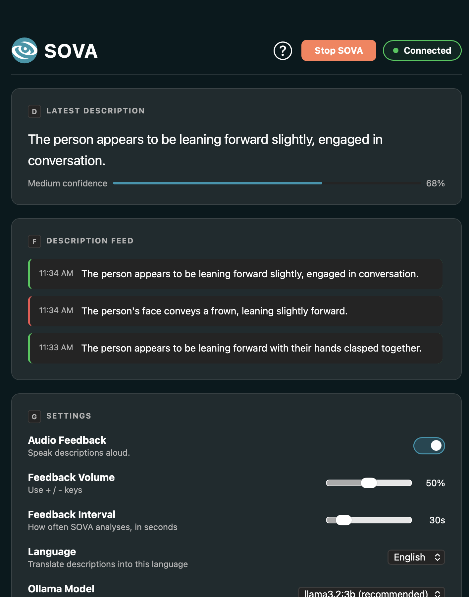

# SOVA
AI-powered video conferencing accessibility tool capable of real-time detection and analysis of non-verbal cues.

[Website](https://sovabyluminara.netlify.app/) | [LinkedIn](https://www.linkedin.com/company/sovabyluminara/) | [Instagram](https://www.instagram.com/sova.luminara/)


### What is SOVA?
SOVA is an accessibility tool that captures your screen while on a video call and transforms the call particiant's facial expressions, gestures, body language, and audio sentiment into descriptive audio feedback.

<!-- 
add screenshot of dashboard & gif of software in action
-->



### Features
- **Expression detection**: Smiling, frowning, eyebrows raised, winking, and open-mouth expressions.
- **Gesture detection**: Thumbs up/down, pointing, waving, peace sign, and phone use.
- **Body action detection**: Person present and person not in frame.
- **Speech sentiment**: Transcribes output audio locally and analyzes tone using NLP sentiment analysis.
- **Audio descriptions**: Generated by a local LLM (Ollama) and delivered via TTS.
- **Desktop app & extension**: Configure settings and view descriptions.
- **Local processing**: Everything runs locally on your device to ensure data privacy and low latency.

## Requirements
- Python 3.11+
- macOS, Windows, or Linux
- Google Chrome (for the extension, *optional*)
- Ollama *(optional)*

## Installation

### 1. Clone the repository
```bash
git clone https://github.com/ofimikfra/SOVA.git
cd sova
```

### 2. Install Python dependencies
```bash
pip install -r requirements.txt
```

### 3. Install Ollama *(optional but recommended)*
Download and install [Ollama](https://ollama.com/download). SOVA will do the rest on first launch.
> Ollama runs the AI model that generates descriptions. Without it, SOVA uses built-in template descriptions instead. 

### 4. Install BlackHole (macOS 12 or earlier)
Download [BlackHole 2ch](https://existential.audio/blackhole/) and set it as your system audio output. SOVA will detect it automatically. If you are using macOS 13+, skip this step.

### 5. Install the Chrome extension
1. Open Chrome and go to `chrome://extensions`
2. Enable **Developer mode** (toggle in the top right)
3. Click **Load unpacked**
4. Select the `extension/` folder inside the SOVA directory

> *Note: A Chrome Web Store install is planned for the future.*

## Usage
### Desktop app
Run this in the terminal:
```bash
python app.py
```
Opens the SOVA desktop app dashboard. Click the ***Start SOVA*** button at the top to start/stop the software.

### Dashboard Settings

| Setting           | Default       | Description                               |
| ----------------- | ------------- | ----------------------------------------- |
| Audio feedback    | On            | Reads descriptions aloud                  |
| Feedback Volume   | 25%           | How loud descriptions are read out        |
| Feedback Interval | 30s           | How often SOVA analyses the call          |
| Language          | English       | Translate descriptions into this language |
| Ollama Model      | `llama3.2:3b` | AI model used for descriptions            |

### Chrome extension

Once installed, join any Google Meet call. The SOVA overlay appears automatically in the bottom-left corner of the call. Click the SOVA icon in your Chrome toolbar to access quick settings.
> Alternatively, use `⌥ + S` on macOS or `alt + S` on Windows & Linux to open the extension.

## Authors
SOVA was developed by team **Luminara**

| Name              | Role                                   | GitHub                                               |
| ----------------- | -------------------------------------- | ---------------------------------------------------- |
| Aagna Samhita     | Team Leader / ML Developer             | [@eggwtv](https://github.com/eggwtv)                 |
| Samia Khan        | Scribe / Frontend Developer            | [@skellereve-ops](https://github.com/skellereve-ops) |
| Sofia Francisco   | Lead Developer / Integration Engineer  | [@ofimikfra](https://github.com/ofimikfra)           |
| Anelle Khare      | Dataset Collection & Preprocessing     | [@Ak200523](https://github.com/Ak200523)             |
| Sandra Jose       | UX & Prototype Enhancement             | [@sandrasuzanne](https://github.com/sandrasuzanne)   |
| Sanura Castellino | Testing & QA                           | [@sanuraaa](https://github.com/sanuraaa)             |
| Sara Hayel        | Backend Developer                      | [@SaraHayel](https://github.com/SaraHayel)           |

## Acknowledgements
- [MediaPipe](https://mediapipe.dev/) — face, hand, and pose landmark detection
- [faster-whisper](https://github.com/SYSTRAN/faster-whisper) — speech transcription
- [Ollama](https://ollama.com/) — local LLM inference
- [DistilBERT](https://huggingface.co/distilbert-base-uncased-finetuned-sst-2-english) — sentiment classification
- [YOLOv8](https://github.com/ultralytics/ultralytics) — phone detection
